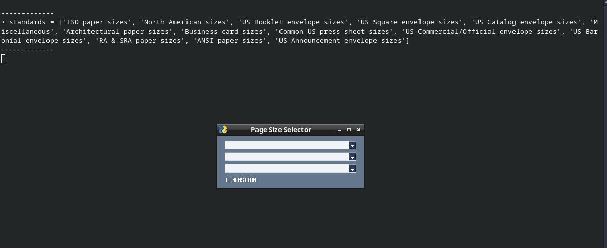
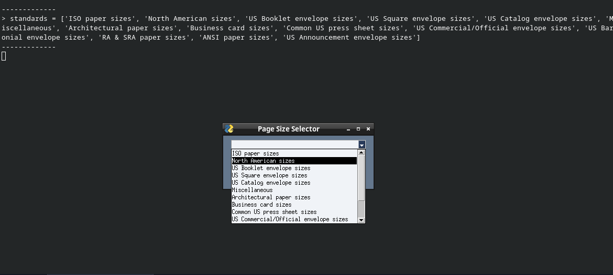
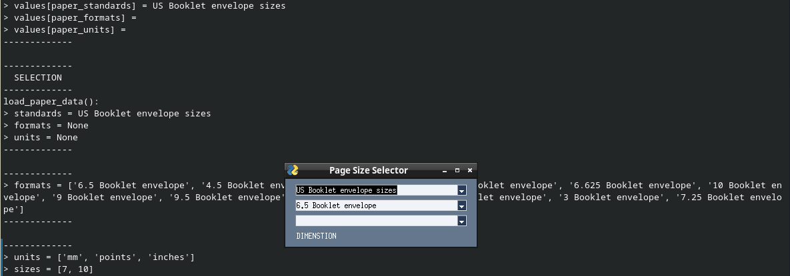
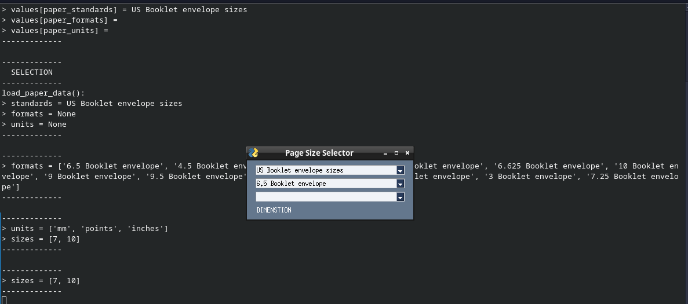
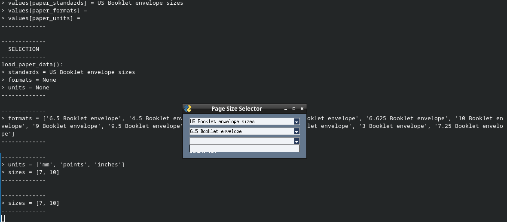

# PageSizeSelector
A graphical interface to select page sizes.

This project is dependant on data from https://github.com/Bubblbu/paper-sizes.

The interface is designed with intent to aid selecction of export layout page/canvas sizes.

The PageSizeSelector interface is being developed to be part of a CadQuery based application.

This is an interface element which will be for selecting formatting of scalable vector graphic output to produce page specific foratted drawings.

It is written with the python programming language, and draws the windows with PySimpleGUI.

I have been writing it for about a week during spare time.

Here is what I have managed to put together.
https://github.com/Technicus/PageSizeSelector

A problem exists somewhere near here: https://github.com/Technicus/PageSizeSelector/blob/main/PageSizeSelector.py#L60, I think.

It can't update the size.

After selecting units, it needs to return the corresponding size list of length and width.

It always returns the inch size list.

